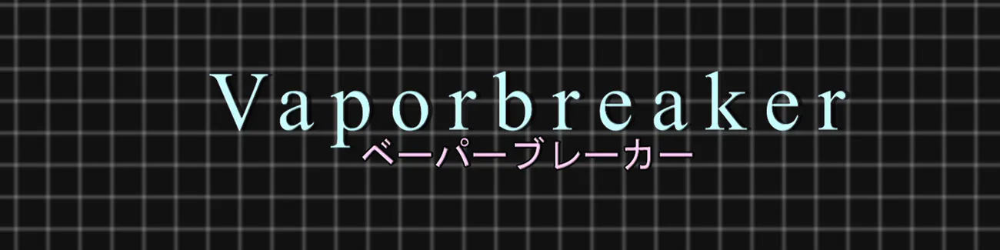

# V A P O R B R E A K E R

## About

My first game developed in Unity. I implemented a lot of things that I learned watching and doing some tutorials of Udemy and Youtube back in mid 2019. It's a basic Arkanoid / Breakout game with some a e s t h e t i c s visual.

## Built with

* Unity
* C#
* Adobe Photoshop CS6
* GIMP
* Audacity

## Running the project locally

* Download `.zip` file or `git clone` this repo.
* Make sure that you have version `2020.1.15f1` of Unity or more recent one.
* Open `Unity Hub` and import the project.
* Open the `Logo Screen` scene, and hit the play button.

## Where to play

* [Web Browser (itch.io)](https://retrogemn.itch.io/vaporbreaker)
* [Web Browser (gamejolt)](https://gamejolt.com/games/vaporbreaker/425523)
* [Windows 10 build](https://github.com/williamdsw/vaporbreaker-desktop/releases/tag/v0.7.0)
* [Linux / Ubuntu 20.04.1 build](https://github.com/williamdsw/vaporbreaker-desktop/releases/tag/v0.7.1)

## Credits

Some thanks for all those asset makers and/or artists!

### Fonts

* ["VCR OCD Mono" by Riciery Leal](https://www.dafont.com/pt/vcr-osd-mono.font)
* ["Aji Hand" by Ajith Rajan](https://www.dafont.com/pt/aji-hand.font)
* ["Migu"](https://www.freejapanesefont.com/migu-font-ミグフォント/)

### Sprites | Images

* Grid Backgrounds by William Santos
* ["Blocks Breaking Block Pack HD" by John B. Marine ](https://opengameart.org/content/block-breaking-block-pack-hd)
* ["Arkanoid Assets" by pudman](https://opengameart.org/content/arkanoid-assets)
* ["Side Blaster GFX (M484 Games)" by Master484](https://opengameart.org/content/side-blaster-gfx-m484-games)
* ["Explosion Set 1 (M484 Games)" by Master484](https://opengameart.org/content/explosion-set-1-m484-games)
* ["Basic Arkanoid Pack" by Zealex](https://opengameart.org/content/basic-arkanoid-pack) 
* ["Free Keyboard and Controllers Prompts Pack" by Xelu](https://opengameart.org/content/free-keyboard-and-controllers-prompts-pack) 
* ["Cassette" by Dmitry Sukhankin (Pong Man)](https://opengameart.org/content/cassette)
* ["Medals" by Buch](https://opengameart.org/content/medals-3)
* ["Basic 16px GUI Pack" by tavoarts](https://tavoarts.itch.io/basic-pixel-gui-pack)
* ["[LPC but not really] Bean Bag and Really Old TV" by Spring](https://opengameart.org/content/lpc-but-not-really-bean-bag-and-really-old-tv)
* ["Pixel Art TV Sprite (CC0)" by Denislav](https://opengameart.org/content/pixel-art-tv-sprite-cc0)
* ["Animated display static" by Cameron 'cron' Fraser](https://opengameart.org/content/animated-display-static)
* ["8th Gen Console Vector Gamepad Collection" by TheHoodieGuy02](https://opengameart.org/content/pixel-art-tv-sprite-cc0)
* ["KeyBoard" by LushkinR](https://opengameart.org/content/keyboard)

### Audio

#### Sound Effects (SE)

* ["Hitting in a Face" by florianreichelt](https://freesound.org/people/florianreichelt/sounds/460509/)
* ["Breaker" by Deathscyp](https://freesound.org/people/Deathscyp/sounds/404049/)
* ["Metal Ping" by timgormly](https://freesound.org/people/timgormly/sounds/170957/)
* ["Blip" by n_audioman](https://freesound.org/people/n_audioman/sounds/275897/)
* ["8 Bit Slam" by josepharaoh99](https://freesound.org/people/josepharaoh99/sounds/361636/)
* ["50 CC0 retro / synth SFX" by rubberduck](https://opengameart.org/content/50-cc0-retro-synth-sfx)
* ["16 button clicks" by Independent.nu](https://opengameart.org/content/16-button-clicks)
* ["Level up, power up, Coin get (13 Sounds)" by wobbleboxx.com](https://opengameart.org/content/level-up-power-up-coin-get-13-sounds)
* ["Pew Laser fire Sound" by sketcherskt](https://opengameart.org/content/pew-laser-fire-sound)
* ["Country Flags" by <b> Mark James (LFA)](https://opengameart.org/content/country-flags)

#### Music Effects (ME)

* ["TV Static Looping" by dotY21](https://freesound.org/people/dotY21/sounds/335203/)
* ["Mission Success" by StormBat](https://freesound.org/people/StormBat/sounds/406371)
* ["80's riff" by ModulationStation](https://freesound.org/people/ModulationStation/sounds/392465/)

#### Background Music (BMG)

* ["Floating Synth Melody at 130 BPM C major loop music" by Lemoncreme](https://freesound.org/people/Lemoncreme/sounds/231578/)
* ["120 bpm lofi synthwave loop" by waveplay_old](https://freesound.org/people/waveplay_old/sounds/424610/)
* ["Time Break" by ShadyDave](https://freesound.org/people/ShadyDave/sounds/277325/)
* ["Reflection" by B_Sean](https://freesound.org/people/B_Sean/sounds/421887/)
* ["Crystalline Phases of Ice" by Pine Voc](https://steviasphere.bandcamp.com/album/snow-cover)
* ["Don't Fall Asleep In The Snow" by Pine Voc](https://steviasphere.bandcamp.com/album/snow-cover)
* ["Glögg" by Pine Voc](https://steviasphere.bandcamp.com/album/snow-cover)
* ["Glimmer, Part 1" by Glaciære](https://steviasphere.bandcamp.com/album/bath)
* ["Glimmer, Part 2" by Glaciære](https://steviasphere.bandcamp.com/album/bath)
* ["Waiting for the train. It's cold." by Glaciære](https://steviasphere.bandcamp.com/album/bath)
* ["Reaction" by Ocean Shores](https://oceanshores.bandcamp.com/album/memories-of-a-past-life)
* ["Windowpane" by Ocean Shores](https://oceanshores.bandcamp.com/album/memories-of-a-past-life)
* ["Gone Away, Out of Mind" by Ocean Shores](https://oceanshores.bandcamp.com/album/memories-of-a-past-life)
* ["Cashflow" by Network 91](https://fantasy-deluxe.bandcamp.com/album/ultimate-opportunity)
* ["More than you know" by Network 91](https://fantasy-deluxe.bandcamp.com/album/ultimate-opportunity)
* ["New Suit" by Network 91](https://fantasy-deluxe.bandcamp.com/album/ultimate-opportunity)
* ["Synthwave Miami Vice Style" by Xhale303](https://freesound.org/people/XHALE303/sounds/470453/)
* ["Synthwave 15k" by The Cynic Project](https://opengameart.org/content/calm-ambient-2-synthwave-15k)
* ["Loading..." by </body>](https://bodyendtag.bandcamp.com/album/initializing)
* ["Updating Settings..." by </body>](https://bodyendtag.bandcamp.com/album/initializing)
* ["Applying Update..." by </body>](https://bodyendtag.bandcamp.com/album/initializing)

### Others

* ["InputManager" by daemon3000](https://github.com/daemon3000/InputManager)